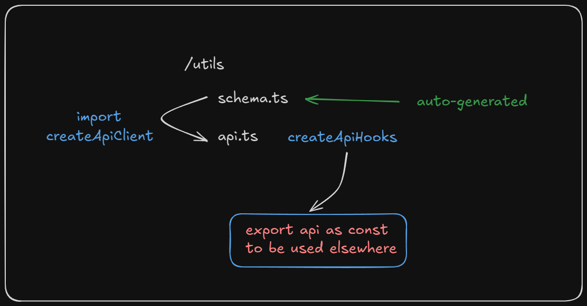
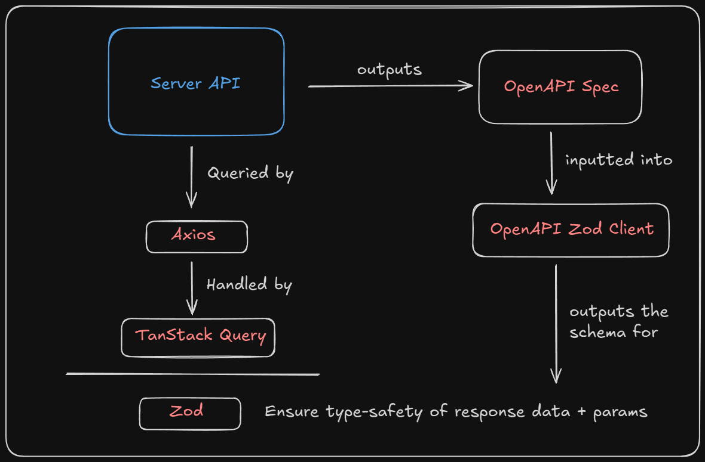

# Frontend Basics

### Reminder

> You can always look at other people's similar code in the project, and copy their code as a quick template. If you have any questions when coding frontend, you can always come ask me too!

## Setting up the dev environment

> The following instructions are only required for the **FIRST** time running react project on your computer

1.  Install **Node.js** from the [official website](https://nodejs.org/en) if you do not have it on your computer.
    You can check whether it is installed by running `node -v` in your terminal.
    _Node is the runtime for our server_

2.  Install **Yarn** by running `corepack enable` in your terminal.\
    Additionally, you can run the following commands to update your yarn version.

        - ```yarn set version stable```

        - ```yarn install```

</br>
Node.js is the main runtime used for running our frontend react server. It also contain a package manager called npm.
However, npm is slow, therefore we are using yarn as our main package manager.

## Setting up the project

> The following instructions are only required everytime you clone a new version from git

1. Clone this repo onto your computer.
   Make sure it is the latest version.

2. Install all dependencies by running `yarn` in your terminal.

3. To boot up the server, run `yarn dev` in your terminal.

## Creating a new web page

Create a new file under the folder **src/routes**
Your file name should correspond to the route name. (eg: sign-in should be sign-in.tsx)

For nested route, put your file inside the parent folder.
(eg: **admin/edit-profile** should be edit-profile.tsx under **src/routes/admin**.
In this case, code for _/admin_ route would be in index.tsx under the **src/routes/admin**)

## Creating a UI component

Create a new file under the folder **src/component**
Do NOT create your component under **src/component/ui**. It is reserved only for shadcn UI components.

## Importing a shadcn ui component

First, check if the component is already imported in the project by going to **src/component/ui**
To import the component, simply copy the npx code in the docs, and run it in the terminal.

## Styling

You are recommended to use tailwind whenever possible. (Its super easy to use too with a cheatsheet). </br>
If you do need custom styling (especially for things like background image, etc), you can create your own module stylesheet, or use the global stylesheet at **src/index.css**
</br>[CSS in React](https://www.w3schools.com/react/react_css.asp)

## Working with API from server

1. Ensure that the schema is up-to-date by running `yarn schema` in the terminal.
2. Find the endpoint you are required to call inside the **src/utils/schema.ts**.
3. Use the endpoint in your component by calling its alias.

```javascript
import { api } from "@/utils/api";

// identical to hooks.useImmutableQuery("/users/search")
const {
  data: users,
  isLoading,
  isError,
} = api.useSearchUsers({ name: "John" });
```

Follow these links to learn more
[https://www.zodios.org/docs/client/react#zodios-hooks-methods](https://www.zodios.org/docs/client/react#zodios-hooks-methods)

### How it is set up



First, the open API specification in the form of YAML or JSON is processed by **openapi-zod-client** and the **src/utils/schema.ts** is auto-generated.
_The input path of specification & output path of the schema is in the package.json ._

Then, the client from the generated schema is created inside **src/utlis/api.ts** which then expose the `api` constant to the rest of the project.

Read more at
[https://github.com/astahmer/openapi-zod-client?tab=readme-ov-file#usage](https://github.com/astahmer/openapi-zod-client?tab=readme-ov-file#usage)

### How it works



- The data from the server is loaded through requests from axios.

- The request and responses are handled through TanStack Query

- Typesafety is ensured by zod schema which is automatically generated by the OpenAPI from the server

# Frontend Libraries

For frontend, we will be using a few libraries and tools to make our life easier

- **Tanstack Router** - Routing (Note: we are using file based routing pattern) </br>
  [Link to Docs](https://tanstack.com/router/latest/docs/framework/react/guide/file-based-routing)

- **Tanstack Query** - Loading data from server </br>
  [Link to Docs](https://tanstack.com/query/latest/docs/framework/react/guides/queries)

- **Zod** - Handling typesafety of data from server </br>
  [Link to Docs](https://www.zodios.org/docs/client/react) </br>
  [LInk to Docs](https://github.com/astahmer/openapi-zod-client?tab=readme-ov-file#usage)

- **Tailwind** - UI</br>
  [Link to Cheatsheet-1](https://www.creative-tim.com/twcomponents/cheatsheet) </br>
  [Link to Cheatsheet-2](https://flowbite.com/tools/tailwind-cheat-sheet/)

# React + TypeScript + Vite

This template provides a minimal setup to get React working in Vite with HMR and some ESLint rules.

Currently, two official plugins are available:

- [@vitejs/plugin-react](https://github.com/vitejs/vite-plugin-react/blob/main/packages/plugin-react/README.md) uses [Babel](https://babeljs.io/) for Fast Refresh
- [@vitejs/plugin-react-swc](https://github.com/vitejs/vite-plugin-react-swc) uses [SWC](https://swc.rs/) for Fast Refresh

## Expanding the ESLint configuration

If you are developing a production application, we recommend updating the configuration to enable type aware lint rules:

- Configure the top-level `parserOptions` property like this:

```js
export default {
  // other rules...
  parserOptions: {
    ecmaVersion: "latest",
    sourceType: "module",
    project: ["./tsconfig.json", "./tsconfig.node.json"],
    tsconfigRootDir: __dirname,
  },
};
```

- Replace `plugin:@typescript-eslint/recommended` to `plugin:@typescript-eslint/recommended-type-checked` or `plugin:@typescript-eslint/strict-type-checked`
- Optionally add `plugin:@typescript-eslint/stylistic-type-checked`
- Install [eslint-plugin-react](https://github.com/jsx-eslint/eslint-plugin-react) and add `plugin:react/recommended` & `plugin:react/jsx-runtime` to the `extends` list

- **Shadcn UI** - PreMade UI components </br>
  [Link to Docs](https://ui.shadcn.com/docs)

Depending on our use case, we can add more libraries too and update this list.
